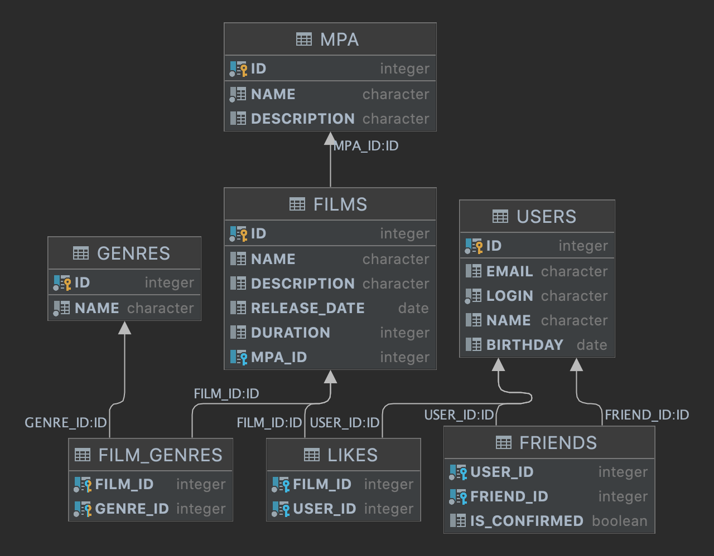

# java-filmorate
Filmorate project

### Схема базы данных

### Таблицы
1. [ USERS ](#USERS)
2. [ FRIENDS ](#FRIENDS)
3. [ FILMS ](#FILMS)
4. [ MPA ](#MPA)
5. [ GENRES ](#GENRES)
6. [ FILM_GENRES ](#FILM_GENRES)
7. [ LIKES ](#LIKES)

#### USERS
    Таблица содержит данные о пользователях:
    первичный ключ id — идентификатор пользователя;
    email - электронная почта пользователя;
    login - логин пользователя;
    name - имя пользователя;
    birthday - дата рождения пользователя;
###### Основные запросы:
      1) Получение всех пользователей
        SELECT * FROM PUBLIC.USERS ORDER BY ID;
      2) Получение пользователя по id
        SELECT * FROM PUBLIC.USERS WHERE ID = ?;
      3) Создание пользователя
        INSERT INTO PUBLIC.USERS (EMAIL, LOGIN, NAME, BIRTHDAY) VALUES (?, ?, ?, ?);
      1) Обновление пользователя
         UPDATE PUBLIC.USERS  
            SET EMAIL = ?, LOGIN = ?, NAME = ?, BIRTHDAY = ?  
          WHERE id = ?;

#### FRIENDS
    Таблица содержит информацию о том какие друзья у пользователя:
     внешний ключ user_id — идентификатор пользователя (отсылает к таблице users);
     внешний ключ friend_id — идентификатор пользователя друга (отсылает к таблице users);
     is_confirmed - статус подвержденности дружбы:
       неподтверждённая — когда один пользователь отправил запрос на добавление другого пользователя в друзья,
       подтверждённая — когда второй пользователь согласился на добавление.
     уникальный составной индекс по столбцам (user_id, friend_id)
###### Основные запросы:
      1) Получение всех пользователей
        SELECT FRIEND_ID FROM PUBLIC.FRIENDS WHERE USER_ID = ?;
      2) Получение пользователя по id
        INSERT INTO PUBLIC.FRIENDS (USER_ID, FRIEND_ID) 
        VALUES (?, ?);
      3) Создание пользователя
        UPDATE PUBLIC.FRIENDS
          SET IS_CONFIRMED = ?
         WHERE USER_ID = ? AND FRIEND_ID = ?;
      1) Обновление пользователя по id
        DELETE FROM PUBLIC.FRIENDS WHERE USER_ID = ? AND FRIEND_ID = ?

#### FILMS
    Таблица содержит данные о фильмах:
     первичный ключ id — идентификатор фильма;
     name - наименование фильма;
     description - описание фильма;
     release_date - дата релиза фильма;
     duration - продолжительность фильма;
     внешний ключ mpa_id - рейтинг МРА (отсылает к таблице mpa);
###### Основные запросы:
      1) Получение всех фильмов
        SELECT * FROM PUBLIC.FILMS ORDER BY ID;
      2) Получение фильма по id
        SELECT * FROM PUBLIC.FILMS WHERE ID = ?;
      3) Создание фильма
        INSERT INTO PUBLIC.FILMS (NAME, DESCRIPTION, RELEASE_DATE, DURATION, MPA_ID)
        VALUES (?, ?, ?, ?, ?);
      4) Обновление фильма по id
        UPDATE PUBLIC.FILMS 
           SET NAME = ?, DESCRIPTION = ?, RELEASE_DATE = ?,  DURATION = ?, MPA_ID = ? 
         WHERE id = ?;

#### MPA
    Таблица - справочник рейтингов Ассоциации кинокомпаний (англ. Motion Picture Association, сокращённо МРА):
     первичный ключ id — идентификатор рейтинга;
     name - наименование рейтинга;
     description - описание рейтинга;
###### Основные запросы:
      1) Получение всех рейтингов MPA
        SELECT * FROM PUBLIC.MPA ORDER BY ID;
      2) Получение рейтинга MPA по id
        SELECT * FROM PUBLIC.MPA WHERE ID = ?;

#### GENRES
    Таблица - справочник жанров:
     первичный ключ id — идентификатор жанра;
     name - наименование жанра;
###### Основные запросы:
      1) Получение всех жанров
        SELECT * FROM PUBLIC.GENRES ORDER BY ID;
      2) Получение жанра по id
        SELECT * FROM PUBLIC.GENRES WHERE ID = ?;

#### FILM_GENRES
    Таблица содержит информацию о том какие жанры у фильма:
     внешний ключ film_id — идентификатор пользователя (отсылает к таблице films);
     внешний ключ genre_id — идентификатор пользователя друга (отсылает к таблице genres);
    уникальный составной индекс по столбцам (film_id, genre_id)
###### Основные запросы:
      1) Получение всех жанров для фильма по его id
        SELECT GENRE_ID FROM PUBLIC.FILM_GENRES WHERE FILM_ID = ? ORDER BY GENRE_ID;
      2) Добавление жанра для фильма
        INSERT INTO PUBLIC.FILM_GENRES (FILM_ID, GENRE_ID) VALUES (?, ?);
      2) Удаление жанра для фильма
        DELETE FROM PUBLIC.FILM_GENRES WHERE FILM_ID = ?;

#### LIKES
    Таблица содержит информацию о том какие пользователи поставили лайки фильмам:
     внешний ключ film_id — идентификатор пользователя (отсылает к таблице films);
     внешний ключ user_id — идентификатор пользователя друга (отсылает к таблице users);
    уникальный составной индекс по столбцам (film_id, user_id)
###### Основные запросы:
      1) Получение пользователей, поставивиший лайк фильму по id фильма
        SELECT USER_ID FROM PUBLIC.LIKES WHERE FILM_ID = ?;
      1) Добавление лайка пользователя фильму 
        INSERT INTO PUBLIC.LIKES (FILM_ID, USER_ID) VALUES (?, ?);
      2) Удаление лайка пользователя фильму 
        DELETE FROM PUBLIC.LIKES WHERE FILM_ID = ? AND USER_ID = ?;